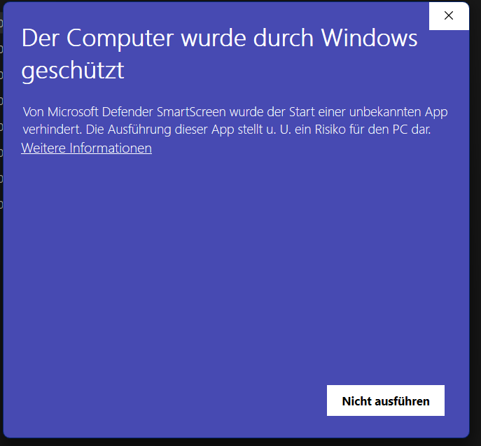

# **This tool is currontly only awaliable on Windows**

# ELW

ELW – Engineer’s Life Workflow

1. gito
    - gito is a tool that easses the access of commiting code to any git platform like github or gitlab.

### This tool has no certificate

if this appears in you installation process please click on More options (Weitere optionen) and then on install start (trodzthem ausführen)

[install](#installation)   [Usage](#Usage)

## installation

How to install this tool:

-   install Release.zip
-   Unzip Release
-   run install.bat
-   open Powershell and run elx setup

## Usage

if installing tools for git:

-   open Powershell
-   run elx install
-   chose git
